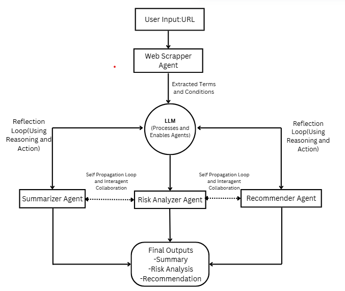

# AIAgents: Terms and Conditions Analyzer

# Members
Christopher Khajira
Esther Ochieng

## Overview

AIAgents is a web-based application designed to simplify and enhance the process of analyzing Terms and Conditions (T&Cs) documents. The application scrapes T&Cs from a given website, summarizes key points, identifies risks, and provides actionable recommendations, all in an intuitive and user-friendly manner. It uses Flask as the backend framework and integrates with AI models for analysis.

---

## Features

1. **Scrape Terms and Conditions**:
   - Extracts T&Cs from any website URL.
   - Handles dynamic content and limits extraction to 2000 tokens for efficient processing.

2. **Summarize Content**:
   - AI-powered summarization of lengthy and complex legal documents.
   - Categorizes text into different topics for better understanding.

3. **Risk Analysis**:
   - Identifies red flags, such as privacy concerns and auto-renewal clauses.
   - Classifies risks into high, medium, or low categories.

4. **Generate Recommendations**:
   - Provides actionable suggestions tailored to the identified risks.
   - Ensures recommendations are concise and specific.

---

## Technologies,Frameworks and Concepts

### ReAct Reasoning

**Description**:  
ReAct (Reasoning + Acting) is a strategy combining reasoning and action to handle complex decision-making tasks in AI. This methodology interweaves reasoning steps with decision-making actions, allowing the AI to think and act iteratively.

**Application in Project**:  
- The AI first reasons about the structure and content of the terms and conditions.  
- It then takes actions, such as extracting key clauses or highlighting potential red flags.  
- This iterative process ensures that the summaries generated are accurate, contextually relevant, and actionable for the user.  

---

### Self-Propagation Mechanism

**Description**:  
Self-propagation refers to a mechanism where AI systems iteratively improve their understanding or output by using the results of one step as input for subsequent steps.

**Implementation**:  
- The summarization system breaks down the document into smaller sections and generates preliminary summaries for each part.  
- These summaries are then aggregated and refined in subsequent passes to ensure consistency and completeness.  
- This iterative refinement leverages feedback loops, enabling the AI to learn from its own outputs and enhance the quality of the final summary.  

### Backend: Flask

**Description**:  
Flask is a lightweight and flexible Python web framework used to develop web applications. It provides essential tools and libraries to build a functional backend.

**Role**:  
In this project, Flask serves as the backend server, handling API requests, managing the interaction between the front end and the AI models, and orchestrating the overall application logic.

---

### AI Tools: LangChain, OpenAI GPT

**LangChain**:  
A framework for building applications powered by large language models (LLMs). It allows seamless integration of AI tools, managing prompt engineering, and chaining multiple reasoning tasks for complex workflows.

**OpenAI GPT**:  
The core AI engine providing natural language understanding and generation capabilities. Specifically, the project uses the GPT model for processing and summarizing terms and conditions.

---

### Web Scraping: BeautifulSoup, Requests

**BeautifulSoup**:  
A Python library used to parse HTML and XML documents. It extracts relevant data from web pages for analysis or processing.

**Requests**:  
A Python library that simplifies making HTTP requests to fetch data from web pages. It is used to retrieve the HTML content that BeautifulSoup processes.

---

### LLM Models: ChatOpenAI

**Description**:  
ChatOpenAI is an implementation of the GPT family designed for conversational AI. It enables context-aware interactions and generates high-quality text responses.

**Role**:  
The ChatOpenAI model is utilized for summarizing legal documents, applying ReAct reasoning, and providing explanations or feedback to users.

### Flow Diagram



## Installation and Usage

### Prerequisites
- Python 3.8 or higher
- Pip package manager

### Steps to Set Up and Run the Application
```bash
```
## Step 1: Clone the Repository
git clone https://github.com/KhajiraCraft/AIAgents.git
cd AIAgents

## Step 2: Set Up Virtual Environment (Optional)
python -m venv venv
## Activate the environment
### On Windows:
venv\Scripts\activate
### On macOS/Linux:
source venv/bin/activate

## Step 3: Install Dependencies
pip install -r requirements.txt

## Step 4: Start the Flask Server
python app.py

## Example Request
### Endpoint: http://127.0.0.1:5000/analyze
### Method: POST
### Body (JSON):
{
  "url": "https://example.com/terms"
}

## Directory Structure
AIAgents/
├── backend/
│   ├── app.py                # Main Flask application
│   ├── chains/
│   │   ├── custom_chains.py  # Custom chains for AI tasks
│   │   └── ...
│   └── requirements.txt      # Dependencies
├── chrome_extension/
│   └── ...                   # Code for Chrome extension (if applicable)
├── venv/                     # Virtual environment (optional)
├── README.md                 # Project documentation


## Contributing
1. Fork the repository.

2. Create a feature branch:
git checkout -b feature-name

3. Commit your changes:
git commit -m "Add feature-name"

4. Push to the branch:
git push origin feature-name

5. Open a pull request.

## License
This project is licensed under the MIT License. See the LICENSE file for details.

## Acknowledgments
- OpenAI for their powerful AI tools.
- Flask for providing a lightweight web framework.
- LangChain for simplifying AI workflows.
- All contributors who made this project possible.
```

